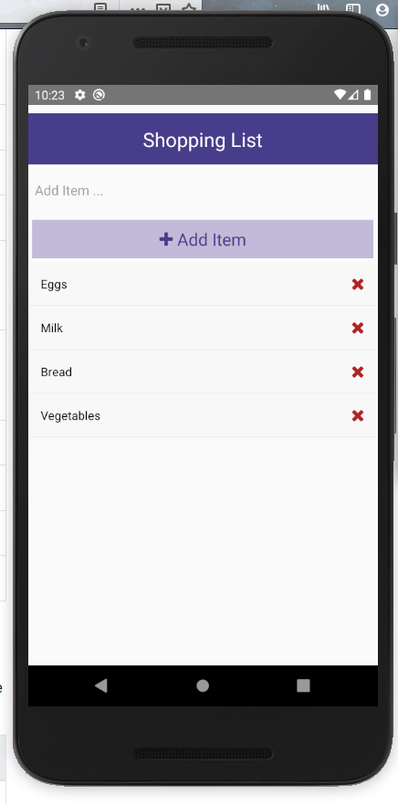
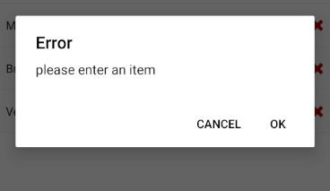

# Shopping Cart App using React native

The App is build using basic react native components ,uuid package and react native vector icons package.

## The basic layout looks like this

### The basic functionality for the app are the following
- A text field to enter the name of the product and add it to the list.
- remove the product from the list by clicking on the cross button
- if u add the empty item by clicking on the add item button it will show you an alert message like this

